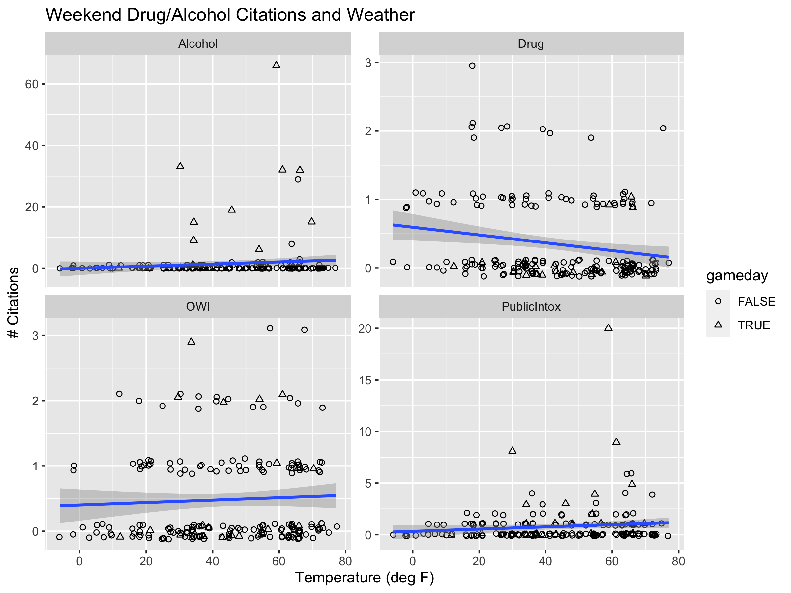

## tidyverse

```{r setup, include=FALSE}
options(htmltools.dir.version = FALSE)
knitr::opts_chunk$set(dpi = 300)
library(tidyverse)
```


`tidyverse` is an 'opinionated' package bundling several other R packages for data science tasks:

```{r}
tidyverse::tidyverse_packages()
```
- https://cran.r-project.org/web/packages/tidyverse/vignettes/manifesto.html

- share common data representations and API, i.e. work well together

- see https://github.com/hadley/tidyverse for more information: [R for Data Science](https://r4ds.had.co.nz/)

- run  `tidyverse::tidyverse_update()` to check if/which for updates

---

## Graphical and numerical summaries


1. graphical summaries - visualizations with `ggplot2`:

    - [RStudio cheatsheet for ggplot2](hhttps://raw.githubusercontent.com/rstudio/cheatsheets/main/data-visualization.pdf)
    
    - online documentation: https://ggplot2.tidyverse.org/
    
    - Google group: https://groups.google.com/forum/#!forum/ggplot2
  
2. numerical summaries - elements of `dplyr` and `tidyr`

  - assessing data quality; data wrangling

  - [RStudio cheatsheet for dplyr](https://raw.githubusercontent.com/rstudio/cheatsheets/main/data-transformation.pdf)
  - [RStudio cheatsheet for tidyr](https://raw.githubusercontent.com/rstudio/cheatsheets/main/tidyr.pdf)
  
---

## The pipe operator `%>%`

`f(x) %>% g(y)` is equivalent to `g(f(x), y)`

i.e. the output of one function is used as input to the next function. This function can be the identity

Consequences:

- `x %>% f(y)` is the same as `f(x, y)`

- statements of the form `k(h(g(f(x, y), z), u), v, w)` become
`x %>% 
   f(y) %>% 
   g(z) %>% 
   h(u) %>% 
   k(v, w)`

- read `%>%` as "then do"


---

## dplyr 

There are five primary `dplyr` *verbs*, representing distinct data analysis tasks:

- **Filter**: Select specified rows of a data frame, produce subsets

- **Arrange**: Reorder the rows of a data frame

- **Select**: Select particular columns of a data frame

- **Mutate**: Add new or change existing columns of the data frame (as functions of existing columns)

- **Summarise**: Create collapsed summaries of a data frame

- (**Group By**: Introduce structure to a data frame)

<br>

`dplyr` resources:

- https://dplyr.tidyverse.org/

- R for Data Science book: https://r4ds.had.co.nz/transform.html

---
class: inverse
## Your Turn

The Iowa State Police Department publishes a Daily Crime Log at https://www.police.iastate.edu/crime-log/

Data for 2017 and most of 2018 are available as file [pd-isu.csv](https://raw.githubusercontent.com/Stat585-at-ISU/materials-2023/master/data/isu-pd.csv) from the course website.

Read the data into your R session and answer the following questions:

- which types of crimes (`Classification`) are typically committed? How many different classifications are there?

- which days are in the top ten for 2018? (Use the `lubridate` package to get to date variables)

- how many times a day are crimes typically reported? 

- what else do you find?

---
class: middle, center
## 


Don't peek unless you have tried for yourself!

---

# a solution 

```{r, message = FALSE, warning = FALSE}
library(tidyverse)
pd <- read_csv("../data/isu-pd.csv")

pd %>% count(Classification) %>% dim()
# 147 different types of crime classifications

pd  %>% count(Classification, sort = TRUE) %>% head()

```


---

Let's check the back, too

```{r}
pd  %>% count(Classification, sort = TRUE) %>% tail()

```
---

# break multiple citings into Main and rest

```{r, warning= FALSE, message = FALSE}
pd <- pd %>% separate(Classification, into = "Main", sep="/",
                      remove = FALSE) %>%
  mutate(
    Main = trimws(Main)
  )

pd  %>% count(Main, sort = TRUE) %>% head()
```

doesn't change much

---

## Top ten bad days in 2018

first get dates, see [RStudio lubridate cheat sheet](https://github.com/rstudio/cheatsheets/raw/master/lubridate.pdf):
```{r message = FALSE}
library(lubridate)
head(pd$`Date/Time Reported`)

pd$date <- lubridate::mdy_hm(pd$`Date/Time Reported`)
summary(pd$date)
```

---

## Top ten bad days in 2018 (2)

Now we want to just have the day rather than the time

```{r}
pd$day <- lubridate::as_date(pd$date)
head(pd$day)
```


---

## Top ten bad days in 2018 (3)

```{r}
pd %>% 
  count(day, sort = TRUE) %>% 
  filter(lubridate::year(day) == 2018) %>%
  head(10)
```


---

## Average number of reports per day

Why is this average not right for the average number of reports by day?
```{r}
pd %>% count(day) %>% summary()
```

--

Problem: we are missing days with zero reports.

---
class: inverse
## Your Turn 


We want to find an elegant solution to the zero reports a day problem.

The function `complete` in the `tidyr` package looks promising.

Try to get it to work for this problem.

---
class: middle, center
##

... only after you tried ...

---

## Average number of reports per day (2)


Why is this still wrong?

```{r}
pd %>% 
  complete(day = full_seq(pd$day, period = 1)) %>% 
  count(day) %>%
  summary()
```

---

## Average number of reports per day (2)


What does `complete` do exactly?
```{r}
pd %>% 
  complete(day = full_seq(pd$day, period = 1))
```

---

## Average number of reports per day (3)

```{r}
perday <- pd %>% 
  complete(day = full_seq(pd$day, period = 1)) %>% 
  group_by(day) %>%
  summarize(
    n = sum(!is.na(Classification))
  ) 

perday %>%
  summary()
```

---

## Crime reports over time

```{r, fig.height = 4, fig.width = 8}
perday %>%
  mutate(year = lubridate::year(day)) %>%
  ggplot(aes( x = lubridate::yday(day), y = n)) + 
  geom_point() + 
  facet_grid(year~.)
```

---

# ... it's the Saturdays that are tricky

```{r, fig.height = 4}
perday %>% ggplot(aes(x = wday(day, label =TRUE), weight = n)) + geom_bar()
```

---
class: inverse
## Your turn

The files [isu-football-2017.csv](https://raw.githubusercontent.com/Stat585-at-ISU/materials-2023/master/data/isu-football-2017.csv) and [isu-football-2018.csv](https://raw.githubusercontent.com/Stat585-at-ISU/materials-2023/master/data/isu-football-2018.csv) consist of the Cyclones' football schedule in 2017 and 2018. 

Use the data to create the chart below:

```{r, echo = FALSE, fig.height = 4, fig.width = 8}

schedule <- read.csv("../data/isu-football-2018.csv")
schedule <- schedule %>%
  mutate(
    date = lubridate::ymd("2018-01-01")
    )
lubridate::month(schedule$date) <- as.numeric(factor(schedule$Month, levels=c("Sep", "Oct", "Nov", "Dec"))) + 8
lubridate::mday(schedule$date) <- schedule$Day
schedule$yday <- lubridate::yday(schedule$date)
schedule$year <- lubridate::year(schedule$date)


schedule17 <- read.csv("../data/isu-football-2017.csv")
schedule17 <- schedule17 %>%
  mutate(
    date = lubridate::mdy(Date)
  )
schedule17$yday <- lubridate::yday(schedule17$date)
schedule17$year <- lubridate::year(schedule17$date)


perday %>%
  mutate(
    year = lubridate::year(day),
    yday = lubridate::yday(day)
    ) %>%
  filter(year <= 2018) %>%
  ggplot(aes(x = yday, y = n)) +
  geom_vline(data = schedule, aes(xintercept = yday, colour = home)) +
  geom_vline(data = schedule17, aes(xintercept = yday, colour = Home)) +
  geom_point(size = .75) +
  facet_grid(year~.) +
  theme_bw() +
  ylab("Number of police reports") +
  xlab("Day of the year")
```

Don't forget to *look at* the chart. What are your main findings?

---

```{r}
# read in schedules and clean up dates
schedule <- read.csv("../data/isu-football-2018.csv")
schedule <- schedule %>%
  mutate(
    date = lubridate::ymd("2018-01-01")
    )
lubridate::month(schedule$date) <- as.numeric(factor(schedule$Month, levels=c("Sep", "Oct", "Nov", "Dec"))) + 8
lubridate::mday(schedule$date) <- schedule$Day
schedule$yday <- lubridate::yday(schedule$date)
schedule$year <- lubridate::year(schedule$date)


schedule17 <- read.csv("../data/isu-football-2017.csv")
schedule17 <- schedule17 %>%
  mutate(
    date = lubridate::mdy(Date)
  )
schedule17$yday <- lubridate::yday(schedule17$date)
schedule17$year <- lubridate::year(schedule17$date)
```

---

```{r, fig.height = 4, fig.width = 8}
perday %>%
  mutate(
    year = lubridate::year(day),
    yday = lubridate::yday(day)
    ) %>%
  filter(year <= 2018) %>%
  ggplot(aes(x = yday, y = n)) +
  geom_vline(data = schedule, aes(xintercept = yday, colour = home)) +
  geom_vline(data = schedule17, aes(xintercept = yday, colour = Home)) +
  geom_point(size = .75) +
  facet_grid(year~.) +
  theme_bw() +
  ylab("Number of police reports") +
  xlab("Day of the year")
```


---
# Strange findings

```{r, echo = FALSE, fig.height = 4, fig.width = 8}
perday %>%
  mutate(
    year = lubridate::year(day),
    yday = lubridate::yday(day)
    ) %>%
  filter(year <= 2018) %>%
  ggplot(aes(x = yday, y = n)) +
  geom_vline(data = schedule, aes(xintercept = yday, colour = home)) +
  geom_vline(data = schedule17, aes(xintercept = yday, colour = Home)) +
  geom_point(size = .75) +
  facet_grid(year~.) +
  theme_bw() +
  ylab("Number of police reports") +
  xlab("Day of the year")
```

- one large outlier not related to football games in Ames
- one game at home not resulting in large number of crime logs? (Kansas - ISU 0 - 45)
- range of two weeks in October 2018 with no crimes logged

---

## Tools for working with data

- moving between wide and long forms of data:

    - `pivot_longer` (formerly `gather`)
    
    - `pivot_wider` (formerly `spread`) 
    
    - see https://r4ds.had.co.nz/tidy-data.html


- joining data sets: `left_join`, `anti_join`, see also https://r4ds.had.co.nz/relational-data.html


---
class: inverse
## Your turn

Does the weather affect the number of citations for drug and alcohol-related offenses? 

Use  [Ames_weather_2017-2018.csv](https://raw.githubusercontent.com/Stat585-at-ISU/materials-2023/master/data/Ames_weather_2017-2018.csv) and combine the data with relevant Ames PD data. 

Graphically examine the relationship between temperature and number of citations. You may find it helpful to only consider Thursday - Saturday.

```{r, message = FALSE}
ames_weather <- read_csv("../data/Ames_weather_2017-2018.csv") %>%
  filter(!is.na(time))

# summarize by day to get daily highs and lows
ames_weather_daily <- ames_weather %>%
  mutate(day = as.Date(date)) %>%
  group_by(day) %>%
  summarize(temp_low = min(temp_low), temp_high = max(temp_high))

```

.small[For the curious: [script to get the weather data](https://gist.github.com/srvanderplas/9f4a471e0fb19495935fb2104f3ba9f8)]

```{r include = F, echo = FALSE, message = FALSE}
library(lubridate)

# Just checking for weirdness
ggplot(data = ames_weather_daily) + 
  geom_ribbon(aes(x = day, ymin = temp_low, ymax = temp_high))

# seems OK
```
---
class: middle,center

... only after you tried ...

---

```{r}
library(lubridate)
substitutions <- c("P[uU]blic Intox.*" = "PublicIntox",
                   "Drug Violation" = "Drug",
                   "Alcohol Violation" = "Alcohol",
                   "Operating [wW]hile Intoxicated" = "OWI")

# Get relevant Ames PD data
drug_alcohol_daily <- pd %>%
  filter(str_detect(Main, "Alcohol|Drug|Intox")) %>%
  mutate(Main = str_replace_all(Main, substitutions)) %>%
  mutate(day = floor_date(date, unit = "day") %>% as.Date()) %>%
  group_by(Main, day) %>%
  summarize(n = n()) %>%
  complete(day = full_seq(.$day, period = 1), fill = list(n = 0))
```

---

```{r yourturn-wkd-drugs-weather, fig.show='hide', fig.width = 8, fig.height = 6}
game_days <- unique(c(schedule$date, schedule17$date))

# Combine the data with weather data
wkd_weather_cites <- drug_alcohol_daily %>%
  left_join(ames_weather_daily) %>% 
  mutate(wday = wday(day, label = T)) %>%
  # Show game days
  mutate(gameday = day %in% game_days) %>%
  filter(wday %in% c("Thurs", "Fri", "Sat"))

# Plot
wkd_weather_cites %>%
  ggplot(aes(x = temp_low, y = n)) + 
  # Jitter in y a bit so points don't overlap as much
  geom_jitter(aes(shape = gameday), height = .125) + 
  geom_smooth(aes(x = temp_low, y = n), method = "lm") + 
  facet_wrap(~Main, scales = "free_y") + 
  scale_shape_manual(values = c(1, 2)) + 
  ggtitle("Weekend Drug/Alcohol Citations and Weather") + 
  scale_x_continuous("Temperature (deg F)") + 
  scale_y_continuous("# Citations")
```

---
class:center



---

# Adding to the data

The ISU-PD department still posts the crime log - but now, in form of a pdf of what looks like a spread sheet. 

Can we still get usable data out of this format?

-- 

There is a package `pdftools` available on CRAN ... but it does not return a data frame (or a tibble) as result. 

We need to look at other formats that R offers ..

