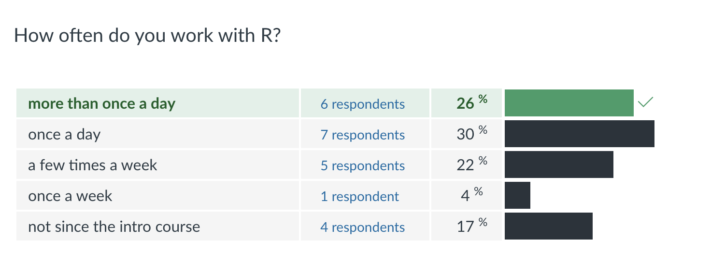
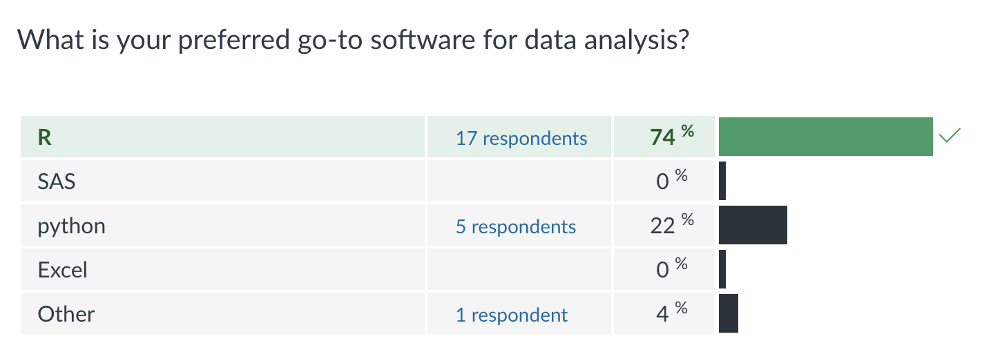
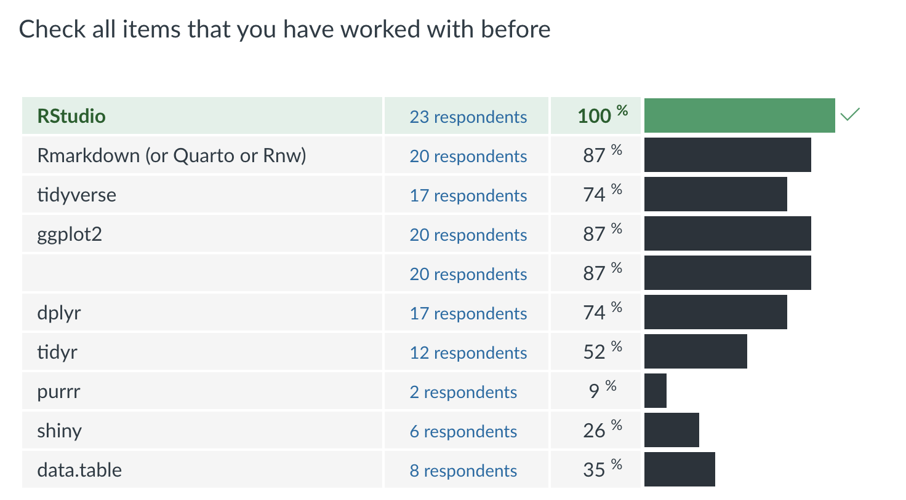

# Results from the survey

```{r setup, include=FALSE, warning = FALSE, message= FALSE}
knitr::opts_chunk$set(echo = FALSE)
library(tidyverse)
```

For how many years have you been working with R?

```{r, fig.height = 3}
dframe <- data.frame(work_with_r =c(3, 2, 2.75, 2, 0.5, 2.5, 1, 1, 0.75, 5, 0.5, 5.5, 1, 1.5, 6, 1.5, 2, 1, 4, 1, 5, 4, 5))
dframe %>% 
  ggplot(aes(x = work_with_r)) + 
  geom_histogram(binwidth = 0.5, colour = "grey80") + 
  scale_x_continuous("Number of years with R", breaks = c(1:6)) +
  theme_bw() + ylab("") +
  geom_hline(yintercept=0:5, colour = "grey80", linewidth=0.15) +
  geom_vline(xintercept=mean(dframe$work_with_r), colour ="darkorange") +
  geom_text(label= sprintf("%.2f years \non average",round(mean(dframe$work_with_r),2)),
            x = mean(dframe$work_with_r)+0.1, y = 4.5, colour ="darkorange",
            hjust=0) 
```

```{r out.width=600}

```

---

```{r out.width=600}

```

```{r out.width=600}

```

