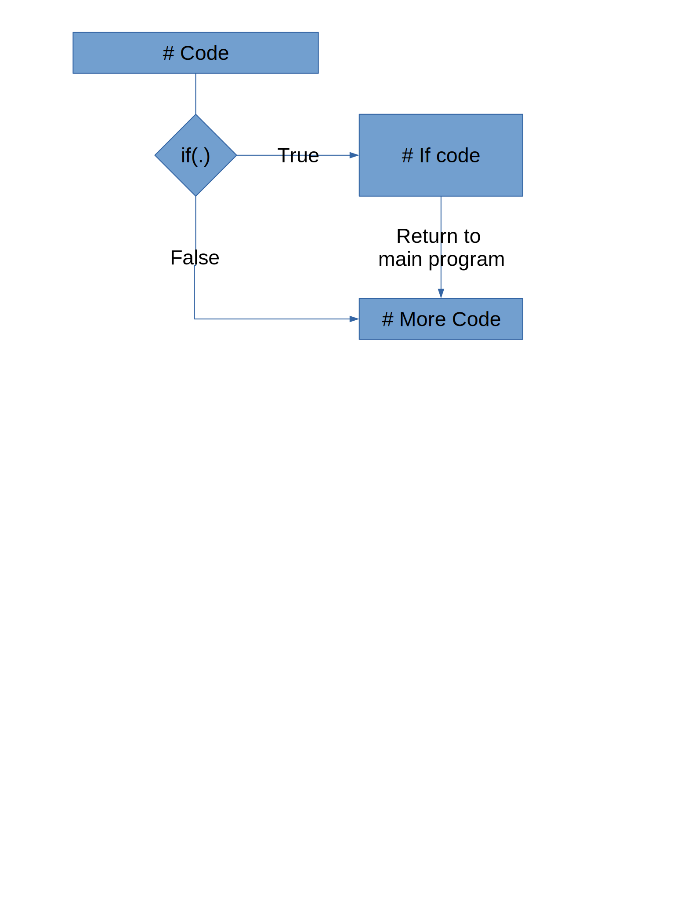
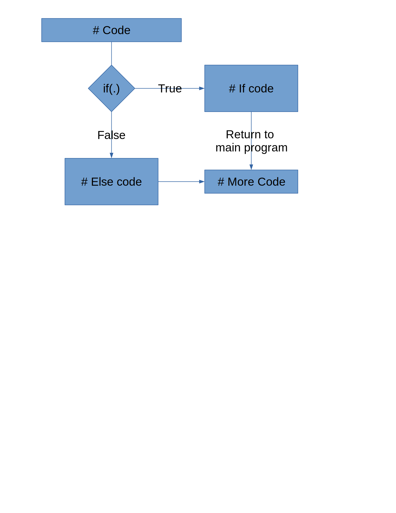

```{r setup, include=FALSE}
options(htmltools.dir.version = FALSE)
```

## Functions in R

- We use functions all the time

- What if there isn't a built-in or package function?

- Idea: avoid repetitive coding (errors, hard to maintain)

- Instead:

--

  - Extract common operations
  
--

  - Wrap in a function
  
--

  - Reuse
  
---

## Basic Structure

- Name

- Input arguments
  - names
  - default value

- Body

- Output values

---

## A first function

```{r, echo = T}
mymean <- function(x) {
  avg <- sum(x)/length(x) # body

  return(avg) # return value - alternatively we could just write `avg`
}

mymean(1:15)
mymean(c(1:15, NA))
```

we want to deal with missing values more gracefully
---

## A first function - take 2

Parameters can have default values. 
Those values are included in the function specification

```{r, echo = T}
mymean <- function(x, na.rm = F) {
  # If na.rm is T, delete the missing value from x
  
  return(sum(x)/length(x))
}


mymean(1:15)
mymean(c(1:15, NA), na.rm=TRUE) # still doesn't do what we want
```


---

## Conditionals

```{r conditionals, eval = F}
if (condition) { # only one set of commands  
  statement      # is executed depending on 
} else {         # whether condition is true
  statement      # or false
}
```

- Condition is a logical **value** (`TRUE` or `FALSE`), i.e. has to be of length 1

- Use `&` and `|` to combine several conditions

- `!` negates a condition (`!FALSE` is `TRUE`)

---

## Conditionals - if()



---

## Conditionals - ifelse 


---

## A first function - take 3

```{r}
mymean <- function(x, na.rm = F) {
  if (na.rm == TRUE) {
    x <- na.omit(x)
  }
  
  return(sum(x)/length(x))
}

mymean(1:15)
mymean(c(1:15, NA), na.rm = F)
mymean(c(1:15, NA), na.rm = T)
```

---

## Function `mymean`

|     |     |
| --- | --- |
| Name | `mymean` |
| Input arguments | `x, na.rm = T` |
|                 | names of parameters, default values | 
| Body | `if (na.rm) x <- na.omit(x)` | 
| | `avg <- sum(x)/length(x)` |
| Output | `return(avg)` |

---

## Function Writing

- Start simple, then extend

- Test out each step

- Don't try too much at once


---
class: inverse
## Your turn

- Write a function `sd` that computes the standard deviation of `x` "from scratch". Include a parameter `na.rm` in it

- $L(\lambda; x) = -n\lambda + log(\lambda) \cdot\sum x_i$ is the log likelihood function of a Poisson variable x with parameter $\lambda > 0$
  - Write a function `loglikpois` with parameters `lambda` and `x` (a vector) that computes the log likelihood value for lambda given observations `x`.
  - Make sure to check that `lambda` is positive; return an error message (using `stop()`) if it is not.
  - Plot the likelihood values for lambda between 0 and 10 for `x = c(1, 3, 2, 3, 0, 1, 0, 1, 3, 3)`
  
---
class: inverse
# Your Turn

Assume you have a string of this form: 

"PTOW\rPTOW\rPTOW\rPTOW\rPTOW\rPTOW\rPTOW\rPTOW\rPTOW\rPTOW\rPTOW\rPTOW\rPTOW\rPTOW\rPTOW\rPTOW\rPTOW\rPTOW\rPTOW\rPTOW\rPTOW\rPTOW\rPTOW\rPTOW"

You are only interested in the values up to the first '\r'.

Good practice would be to check that all of the other values are just a repeat of the pattern

Write a function `clean_duplicates` that takes a character value as an argument and returns a (cleaned-up) character.

---

## Good Practice

- Use tabs to structure blocks of statements

- Build complex blocks of codes step by step
    - A function should complete one task
    - Chain multiple functions together with a meta-function for more complex tasks

- `# write comments!`


---

## Testing

- Always test your functions!
    - Check input types - #1 source of issues

- Even better: Have someone else test them for you

---

## When Things Go Wrong...

Debugging is an art, not a science

- By yourself
  - check your code step by step (browser ehlps with that)
  - explain your code to an inanimate object    
  .small[([traditionally, a rubber duck](https://en.wikipedia.org/wiki/Rubber_duck_debugging))]
  - include print statements to check intermediate results and assumptions
  - use `browser()`
  - investigate all warnings
  
- Ask a friend to look over your code <div style='position:relative; padding-bottom:calc(51.54% + 44px)'><iframe src='https://gfycat.com/ifr/ShockedSmoggyAnkole' frameborder='0' scrolling='no' width='50%' height='50%' style='position:absolute;top:0;left:0;' allowfullscreen></iframe></div><p></p>

