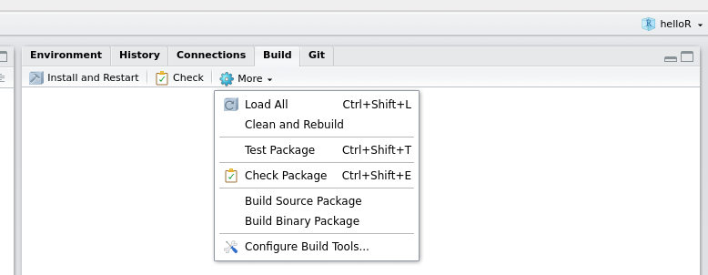

class: center, middle

```{r setup, include=FALSE}
options(htmltools.dir.version = FALSE)
```

## Outline
.left[
- Motivation

- Automated Testing and Unit Tests

- Testing Functions in R with `testthat`

- Coverage

- Package Checks 

]

???

This set of slides is going to cover a lot of ground - current best practices for testing to make sure your code does what you want it to do, how to automate the test process so that it isn't too tedious, setting your package up to automatically test itself with each new commit, and then how to make sure each line of your package is tested. It's a lot, and it's pretty easy to get lost in the weeds, so please stop me and ask questions. 

---

## So you have a package

Workflow:

1. Write a function.

2. Load it with `Ctrl/Cmd + Shift + L` or `devtools::load_all()`

3. Experiment with it in the console to see if it works.

4. Rinse and repeat.

<br/><br/>

???
Typically, you write a function, you test it informally and experiment to make sure it's doing what you want it to do, and then you fix it, reload it, and test it again.

--

Testing in this workflow is informal, but can be repetitive and tedious. 


---
class:middle,center
# Automated Testing

???
There are more structured ways to do this same task, though, and it's helpful to use them when you're working on a large or complex problem. 
---

## Unit tests

Tests that evaluate one feature of a function


They are run automatically after you make changes to the code


Unit tests are one part of the larger framework of _Test Driven Development_

???

Unit tests are tests that evaluate a single unit of code (ideally, each function only does one thing, so a test of a function is a test of that single unit). In a testing framework, each time you make changes to the code, you run all of the tests to ensure that everything is still working. Unit tests are part of a larger philosophy called test driven development. 
---

## Unit tests

Tests that evaluate one feature of a function


They are run automatically after you make changes to the code


Unit tests are one part of the larger framework of _Test Driven Development_


## Test Driven Development

_Test Driven Development_ is an approach to programming where the unit tests are written before the actual code

- Requirements are decided in advance

- Code must meet the requirements (and only the requirements)

???

Test driven development is one philosophy of how to develop code. It's useful in its place, but I'm not going to say it's the only way to develop code. However, it's a nice way to think about things - you think first about what you want the function to do, then you write tests to ensure the function does that thing. Then, and only then, you write the function to satisfy those tests. The goal is to get a minimal set of code to fullfill the essential functions, and to make sure that every essential function is tested.

---

## Unit Tests are like Vegetables


---
## Why use unit tests?

For a bit of extra work, you get: 

- Fewer bugs
    - Essential functions are tested and issues are caught quickly
    - Visual confirmation that essential features are working
    - When debugging, write a test to pinpoint the bug (and stop it from reoccurring)

- Better code structure
    - Modular code: do only one thing per function
    - Document functions as you write them to satisfy tests

- Robust code 
    - make big changes quickly and without downstream problems
    - Any changes that break things should be caught with tests

- (in theory) Easier to start after a break:    
pick up at the last failed test and write code to satisfy that test

???

The advantages of unit testing and test driven development are mostly from the extra structure of ensuring you write only the code you need. 
- If you're testing each function, you'll tend to make your functions smaller, so that they only do one task that can be tested. These modular functions are easier to work with later, too, because you can usually see exactly where something breaks. 
- You'll get fewer bugs, because you are testing each essential feature; when you do get a bug, you write a test for the bug so that it doesn't reappear later. 
- Your functions will be easier to document, because you wrote out ahead of time exactly what they do
- When you're interrupted, you write a test for the thing you were going to work on, then you pick up where the test failed and start writing code at that point.

You can use unit testing without buying into the whole test driven development framework, though - see how it works for you, and then you can get more serious about it later.

---
class:middle,center
# Testing in R: `testthat`

???
Unit testing in R is most commonly done with the `testthat` package. It integrates with RStudio nicely and makes it fairly easy to write tests for your R functions. As with the other functions today, we'll use the `usethis` package to set up `testthat`.

---

## Tools for package testing

1. `testthat`: unit testing for R packages
  
  - structured R package testing
  
  - provides functions to set up and tear down testing environments
  
  - runs each set of tests in a clean environment
  
  - reports whether each test passes or fails

2. `usethis`: helper functions for R package development

  - set up `testthat` for your package: `usethis::use_testthat()`
  
  - create new test files: `usethis::use_test("test1")` creates a new test file

.small[Note: `testthat` works with packages. [This github issue](https://github.com/r-lib/testthat/issues/659) has a good discussion of testing outside of the package framework]

???

The `testthat` package provides a structure for R package testing. You can set up a test environment, run your tests automatically in that clean environment, then tear the environment down. At the end of the test process, you get a report about which tests pass and fail.

The `usethis` package has some helper functions for R package development, including functions to set up your package to use `testthat`. If you want to create some new tests, you can use the `usethis` command `use_test("testname")` and it will create a file with the right structure in the right place.

---

## Package Testing Workflow

1. Modify your code or tests

2. Test your package (`Ctrl/CMD - Shift - T`)

3. Repeat until all tests pass

???

With `testthat`, the workflow becomes: modify your code or tests, run your tests, repeat until everything passes. It's more structured than the previous workflow, and you run the same tests each time, so you know that your function is working with the same tests - it's much harder to forget something you used to test!

---
class:inverse
## Your Turn

```{r, eval = 2}
install.packages(c("testthat", "usethis"))
library(testthat)
```

1. Install the `testthat` package for unit testing and the `usethis` package (helper functions to make package development easy)

2. Set the `worldle` package up to work with `testthat`

```{r, eval = F}
# Run create_package to add package infrastructure 
# Adjust the path to refer to your current project directory
usethis::use_testthat()
```

What does your file structure look like now? 

???
In this your turn, install usethis and testthat, and load them. 

You're going to make a new package and set it up to work with testthat. You'll need to set up a github repository for your package. Use RStudio to clone that github repository, and then use the `usethis` package to create a package structure. 

Once you've set that up, you're ready to set up `testthat`.

Your file structure: a Description and namespace file, an R folder with an R file, and a tests folder. Inside the tests folder is a testthat.R file and a testthat directory, which will contain your unit test files. 
---

## Testing Structure

A test file consists of 

1. context - a description of the test blocks in the file

2. one or more test blocks:    
`test_that(description, {test statements})`

```{r, eval = F}
context("test-basics")

# Test block
test_that(
  # description
  "multiplication works",
  { # test statements inside this block
    expect_equal(2 * 2, 4)
  }
)
```
???

Now that our package is set up to use testthat, we have to figure out how to actually write unit tests. 

A test file has a context (a description of what you're testing inside the file) and then one or more test blocks. A test block consists of a test_that() statement, a description of what the test block is testing, and then an expression containing one or more expectations.

An expectation is a function that starts with expect_ and details a condition that should be met. In the statement here, testing whether multiplicaiton still works, we expect that 2*2 equals 4. 

`testthat` is pretty good about this - when testing equality, we have to consider machine precision. `expect_equal` uses `all.equal()` to test equality, so it isn't going to throw an error if there are tiny differences in the two numbers. 

A block of tests can have multiple expectations, so if you need to check that 0\*1 = 0 and -2\*2 = -4, you can do those tests in the same block.

---

## Test Statements

`testthat` has a series of expectation functions:

function | description
---- | ----
`expect_equal(obj, value)` | Is the object equal to a value?
`expect_error(expr)` | Does the expression produce an error?
`expect_gt(obj, value)` | Is the object greater than the value?
`expect_length(obj, value)` | Does the object have length value?

See more with `help(package = "testthat")`

These functions are silent if the expectation is met, and throw an error otherwise.

Expectations are used to construct tests. 
<!-- When included in a test file, they will be run automatically; when run on their own, you can see how they work -->
???
There are a bunch of different expectation functions in testthat. You can test for equality, whether something is greater than a value (or less than), that something has the correct lengths, or throws an error or warning. Just like with assertions and `assertthat`, you can test multiple facets of a single object to make sure things are exactly as you've specified. 
---
class:inverse
## Your Turn - Writing Expectations

1. Create a test file with `usethis::use_test("austria")`

2. Write a set of expectations that test the `austria` data to make sure it has the correct format    
What are the important/essential features of the data?


.center[]
.center[If `austria` was abducted, would you notice?]
???
Write a series of tests for the `mtcars` data - if you accidentally overwrote the default mtcars, what would you want to test to make sure it was the real thing?

To do this, you'll have to identify the essential features of the data - if the structure is essentially the same, your functions should work correctly, but if the structure changes in some way, you would need to detect those changes. 

Focus on writing the expectations right now - we can put them into a test block afterwards.

---

## Solutions
```{r}
data(austria, package = "worldle")

# correct type
expect_type(austria, "list")
expect_s3_class(austria, c("sf","tbl_df", "tbl", "data.frame"))

# correct dimensions
expect_equal(dim(austria), c(9, 12))

# correct column names
expect_named(austria, c("ID_0", "COUNTRY", "ID_1", "NAME_1", "VARNAME_1", "NL_NAME_1", "TYPE_1", "ENGTYPE_1", "CC_1", "HASC_1", "ISO_1", "geometry"))
```
???
First and foremost, we care that it's the right data type - a data.frame, which is an s3 class.

We want mtcars to have the right number of dimensions - you could test these separately with `nrow` and `ncol` if you want. 

Then we want to make sure it has the right names, right? If we refer to the columns by name, we need to make sure they're all there!
---

## Solutions
```{r}
# hardcore option: use dput() to record structures
# dput(head(austria %>% dplyr::select(-geometry)))
austria_head_no_geo <- structure(list(ID_0 = c("AUT", "AUT", "AUT", "AUT", "AUT", "AUT"
), COUNTRY = c("Austria", "Austria", "Austria", "Austria", "Austria", 
"Austria"), ID_1 = c("AUT.1_1", "AUT.2_1", "AUT.3_1", "AUT.4_1", 
"AUT.5_1", "AUT.6_1"), NAME_1 = c("Burgenland", "Kärnten", "Niederösterreich", 
"Oberösterreich", "Salzburg", "Steiermark"), VARNAME_1 = c("Burgenlândia", 
"Carinthia|Caríntia|Carintia", "Lower Austria|Baixa-Áustria|Baja Austria|Niederdonau|Österreich unter der Enns", 
"Upper Austria|Alta-Áustria|Alta Austria|Österreich ober der Enns|Oberösterreich", 
"Salzburgo", "Styria|Est¡ria|Estiria"), NL_NAME_1 = c(NA_character_, 
NA_character_, NA_character_, NA_character_, NA_character_, NA_character_
), TYPE_1 = c("Bundesländ", "Bundesländ", "Bundesländ", "Bundesländ", 
"Bundesländ", "Bundesländ"), ENGTYPE_1 = c("State", "State", 
"State", "State", "State", "State"), CC_1 = c(NA_character_, 
NA_character_, NA_character_, NA_character_, NA_character_, NA_character_
), HASC_1 = c("AT.BU", "AT.KA", "AT.NO", "AT.OO", "AT.SZ", "AT.ST"
), ISO_1 = c(NA_character_, NA_character_, NA_character_, NA_character_, 
NA_character_, NA_character_)), row.names = c(NA, -6L), class = c("sf", 
"tbl_df", "tbl", "data.frame"), sf_column = "geometry", agr = structure(c(ID_0 = NA_integer_, 
COUNTRY = NA_integer_, ID_1 = NA_integer_, NAME_1 = NA_integer_, 
VARNAME_1 = NA_integer_, NL_NAME_1 = NA_integer_, TYPE_1 = NA_integer_, 
ENGTYPE_1 = NA_integer_, CC_1 = NA_integer_, HASC_1 = NA_integer_, 
ISO_1 = NA_integer_), .Label = c("constant", "aggregate", "identity"
), class = "factor"))

expect_identical(austria_head_no_geo, head(austria %>% dplyr::select(-geometry)))
```
Choose your tests carefully - too specific, and they'll break unnecessarily

???

One way to make sure that the structure is what you want it to be is to use `dput`, which provides the code to generate an R object. You can paste that into the test file, and then test whether the two objects are equivalent. 

In this case, this may not be the *best* option, but it's a useful demonstration.

---

## Solutions

Once we have our set of tests, we turn them into a test block:

```{r, eval = F}
context("testing austria")
data(austria)

test_that("austria is properly formatted", {
# correct type
expect_type(austria, "list")
expect_s3_class(austria, c("sf","tbl_df", "tbl", "data.frame"))

# correct dimensions
expect_equal(dim(austria), c(9, 12))

# correct column names
expect_named(austria, c("ID_0", "COUNTRY", "ID_1", "NAME_1", "VARNAME_1", "NL_NAME_1", "TYPE_1", "ENGTYPE_1", "CC_1", "HASC_1", "ISO_1", "geometry"))
})
```

Save your test file, and then you can test your package with `Ctrl/CMD - Shift - T`. 
???
Once you have the expectations written, it's fairly easy to fit them into a structured testthat file: just add the expectations to a `test_that` function, add the description, and add the `test_that()` function and context to a file. Then you just save your files and test your package!

---

## Test-Driven Development Workflow

1. Write out the specifications for your function

2. Create your test file `usethis::use_test("foo")`

3. Write tests for your function in `tests/testthat/test_foo.R`

4. Write your function and documentation in `R/foo.R`

5. Test your package: `Ctrl/CMD - Shift - T` or use the Build Menu

.center[]

???
If you use the test driven development workflow, you'll follow these steps: 

First, you write out what your function is going to do and what structure it will have. Then you create the test file for the function and fill in your tests - each thing the function is supposed to do will require a test to ensure that function is working correctly.

Once your tests are written, you make the .R file where the actual function will live. You write the function so that it passes the tests, and you document it as you go (since you already wrote out what the function does, this doesn't take long). 

Then, you test your function to make sure it passes the tests. If it doesn't, modify your code (or tests) and rerun the tests until it passes. 
---

## Test-Driven Development Example

Function: `mymean(x, na.rm)`

Important behaviors: 

???
Suppose we want to create a function `mymean` that has parameters x and na.rm. We want this function to issue an error if x is not numeric, and if it is numeric to calculate the mean. If x contains NAs, the function should return NA if na.rm = F, and the mean of x without any NA values if na.rm = T. 
--

- issue a warning when x is not numeric and return NA

--

- return `NA` when x has `NA`s and `na.rm = F`

--

- return a value equal to `sum(x)/length(x)` when x has no `NA` values 

--

- return a value equal to `sum(x2)/length(x2)` where    
`x2 = x[!is.na(x)]` if `na.rm = T`

---

## Test-Driven Development Example

Important behaviors: 


- issue a warning when x is not numeric and return NA

```{r, eval = F}
x <- letters[1:3]
expect_warning(mymean(x)) # This is the minimal test
expect_warning(mymean(x), # This tests for a specific warning
               "argument is not numeric or logical: returning NA") 

# This tests the value and that a warning is generated
expect_warning(
  expect_true(is.na(mymean(x))) # Function returns NA
)

```

???
Our expectation for non-numeric input is that mymean returns NA and a warning. We could test for a specific warning, or we could test that a warning is issued and leave it at that. Initially, it's probably better to test for the presence of a warning, but as your package matures you may want to check that specific warnings are generated to make sure your function is responding to the right thing.
We also want to test that mymean returns an NA. Note that this will still generate a warning, so we have to actually wrap the two functions.

---

## Test-Driven Development Example

- return `NA` when x has `NA`s and `na.rm = F`
```{r, eval = F}
# Can also test to see if a test fails...
expect_failure(
  expect_equal(mymean(c(1:8, NA), na.rm = F), mymean(c(1:8)))
)

# Or test if something returns NA
expect_true(is.na(mymean(c(1:8, NA))))
```
???
We can expect a test to fail, which is a bit strange but useful - we want the values to be different in this case. 

Alternately, we can test to see if the function returns NA, which is a more specific test of the behavior we want.

In general, it's best to test for specific behaviors, but there's an art to how specific your tests should be.
---

## Test-Driven Development Example

Important behaviors: 
- return a single numeric value equal to `sum(x)/length(x)`

```{r, eval = F}
x <- 1:8
y <- c(1:8, NA)

# Test that mean(1:8) returns a numerically correct response
expect_equal(mymean(x), 4.5)

# Test that mean(c(1:8, NA)) equals mean(1:8) when na.rm = T
expect_equal(mymean(y, na.rm = T), mymean(x))
```
???

We can first test that mymean returns a correct response, and then check that it returns the same response when an NA is added and na.rm is true.
---
class:inverse
## Your Turn

In your `worldle` package, do the following: 

1. Create the file `R/mymean.R` for your `mymean` function

2. Create a test file for `mymean`: `usethis::use_test("mymean")`

3. Add the expectations in the previous slides to your test file in a test block

4. Write the `mymean` function in `R/mymean.R` Use `roxygen` tags to document the function. 

5. Save your test and code files, build your package (`Ctrl/CMD-Shift-B`), then test your package (`Ctrl/CMD-Shift-T`). Did your function pass?

???
In this yourturn, use the expectations we talked about in the previous slides and implement `mymean` for your package. Use Test-driven development practices - so make the test file first, then write the function. Add documentation to your function, and when you're done, save your files, build your package, and test it. Does your function pass?


---

## Unit tests are...

- Modular (by design)

- Quick to run

- Run in an clean environment<br/>    
    - Set up and Tear down tasks set up the environment for testing
    
- Independent - don't require outside files (traditionally)

???
Unit tests are supposed to be run in a clean environment - they shouldn't depend on objects that you have in your environment, unless you write the code to set those objects up and tear them down after the tests are run. Each set of tests should run as a single module, and they should run relatively quickly - try to test a small computation so that the entire test suite runs in under a minute or two at most (remember, these tests run after every package check, and in every travis-ci build, so they're going to run frequently)
---

## Unit tests

> But, we're statisticians. What about the data?

- use tiny test data (`dput()` is helpful)

- read in toy data from files in the test directory

- use data included with the package

- use data included in base R

- download data from elsewhere with a set-up function, delete it with a tear-down function
    - tests will fail without internet or if the site is down
???

Some of you may be wondering how we test statistical functions if we are trying to not depend on outside objects, like... data. Where possible, we want to use test data, package data, and other convenient data sets. If you can test your functions with mtcars, by all means, do so. Make it easy and boring. 

In other situations, you need more complicated data types. You can set up functions to download your data and set up your environment, but you need to make sure you clean up those files afterwards by using the tear-down functions; you also need to make sure to skip the tests if internet isn't working (testthat has a way to skip tests on travis or CRAN checks, or if certain conditions are satisfied.)

---
class:inverse
## Your Turn

Take a look at the function `get_shapes` in your `worldle` package:

- Function specifications: 
    - name: `get_shapes`
    - Parameters url and level:
        - Function should error if `url` is not a valid url or `level` is not an integer
        - Function should return an error if the country's shapefiles do not exist at the specified level
    - Function should return a data frame with shape files similar to `austria` 
        - modify the expectations using a different example

1. Create a test file for this function and write appropriate tests

3. Does your function pass your tests? 
???

This time, I want you to take a function description and write the tests and expectations from scratch. Use the same workflow you used in the previous yourturn. Remember to use assertions in your function! They're helpful to generate good error messages - messages that you can test!

---
class:middle,center
# Code Coverage: `covr`
???
Once you get travis set up, you can set up covr, which is a pretty sweet little package. 
---

## Code Coverage

> How many unit tests are enough? Is everything tested?

- `covr` is a package that will:
    1. build your package in a clean environment 
    2. run your tests
    3. determine how many times each line was evaluated (through [magic](https://cran.r-project.org/web/packages/covr/vignettes/how_it_works.html))
    4. launch a Shiny app to show you line-by-line coverage reports
    
- 100% coverage is good, but unit tests aren't everything
    - Some lines aren't worth testing
    - Integration testing matters too!

```{r, eval = F}
covr::report() # Run a local code coverage report

```
???
Covr is pretty nice because it will tell you (using magic!) exactly which lines were run during your test suite. So if you have an if statement that isn't tested, it will let you know. It'll also tell you how many times a line of code has been run. It's pretty amazing. 
---
class:inverse
## Your Turn

1. Run a code coverage report locally for your `worldle` package using `covr::report()`

2. Run `use_tidy_github_actions()`. 
This will activate all three main workflows: checking the package, running a code coverage report and re-publishing the website
