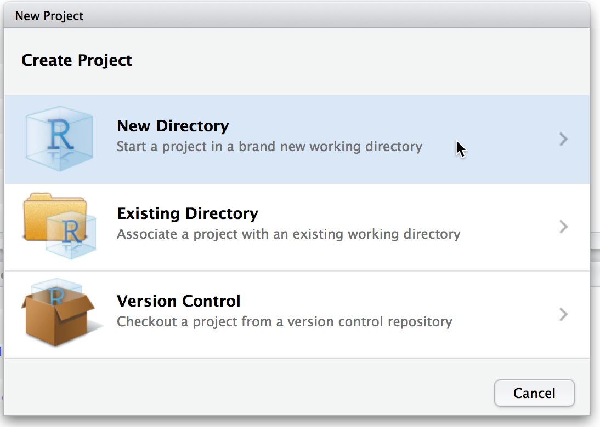
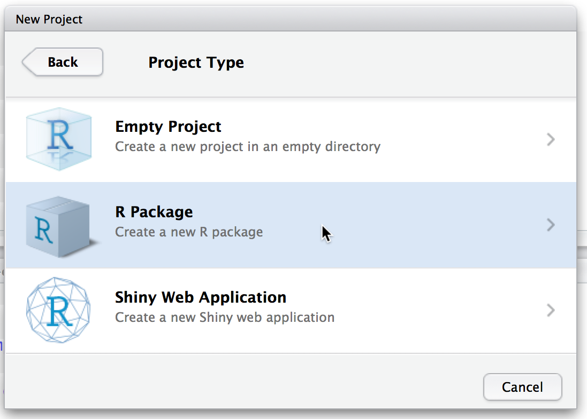
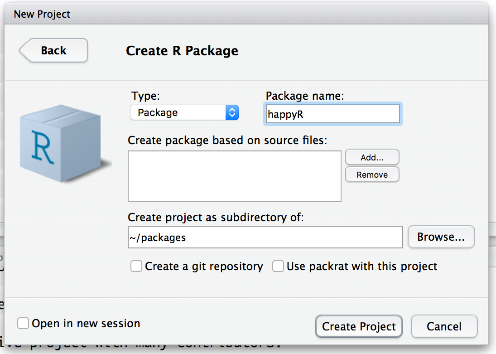
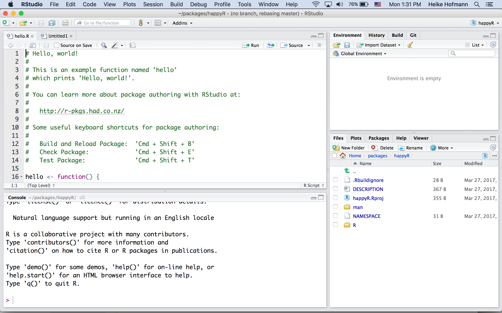

```{r setup, include=FALSE}
options(htmltools.dir.version = FALSE)
```

## Outline

- file structures of packages

- documentation

- data in packages

<br>
<br>
<br>

Resource: [R packages](http://r-pkgs.had.co.nz/) by Hadley Wickham
---

## RStudio and R packages

RStudio supports creating new packages. Follow the dialogs through `New Project ...`



---

## RStudio and R packages (cont'd)

RStudio supports creating new packages. Follow the dialogs through `New Project ...`



---

## RStudio and R packages (cont'd)

RStudio supports creating new packages. Follow the dialogs through `New Project ...`



---
class:center,middle



---
class: inverse
## Your Turn 

- Create a new R package using the RStudio dialog to set it up in a new project.

- Build the package (CMD + shift + B) and run the function `hello()`

- Have a look at the help for `hello`

---

## `devtools`

Once you have a package, the `devtools` package provides functionality to support your development

`devtools` functions operate on the active project (the folder of your project):

- `document()` creates R help files from special comments in your code (talk about that in a bit)

- `install()` installs the package, i.e. afterwards you can activate the package with the command `library("your package")`

- `check()` runs a couple of tests on your package. All of these have to be passed without warning before you can upload a package to CRAN

---

## File structure

Within folder that has the same name as your R package:

- DESCRIPTION

- NAMESPACE

- R

- man

- data

R code files go into the folder `R`, data sets go into the folder `data`, Rd files contain documentation and go into `man`

---

## DESCRIPTION

plain text file with all the meta information on a package

```
Package: happyR
Type: Package
Title: What the Package Does (Title Case)
Version: 0.1.0
Author: Who wrote it
Maintainer: The package maintainer <yourself@somewhere.net>
Description: More about what it does (maybe more than one line)
    Use four spaces when indenting paragraphs within the Description.
License: What license is it under?
Encoding: UTF-8
LazyData: true
Imports: package1,package2
Suggests: package3
Depends: package4,package5
```

[Description file reference](http://r-pkgs.had.co.nz/description.html)

---

## Package dependencies: Imports, Suggests, Depends


- **Imports:** packages in this list must be present for your package to work
    - Imports are NOT attached when your package is loaded
    - You must refer to functions in these packages using `package::function()` or import them using roxygen tags (`@import`, `@importFrom`)


- **Suggests:** packages in this list may add functionality but are not necessary
    - e.g. for example data, unit tests, build vignettes

- **Depends:** packages in this list are attached when your package is loaded    
__Hint:__ It is better practice to use `Imports` rather than `Depends`. `Depends` might overwrite a previously loaded function of the same name (cause of some of the `plyr` - `dplyr` animosity)

[Namespaces reference](http://r-pkgs.had.co.nz/namespace.html#namespace) - why Depends is a bad idea

---

## Licenses

- There's a (surprising?) range of common use licenses available: http://www.r-project.org/Licenses/

- More licenses at http://creativecommons.org/choose/ and  http://www.opensource.org/licenses/category

- Flowchart for picking a [(type of) license](http://creativecommons.org.au/content/licensing-flowchart.pdf)

- Most often used: GPL-2, GPL-3, MIT

    - GPL-2/3: "run, copy, distribute, study, change and improve the software" now and in the future, i.e. preserve open-source nature

    - GPL-3 clears up some inconsistencies and ambiguities in GPL-2 and should be used in new projects

    - MIT releases software completely and also allows use in commercial projects, removes liability of provider.

---

## Documentation

hello.Rd:

```
\name{hello}
\alias{hello}
\title{Hello, World!}
\usage{
hello()
}
\description{
Prints 'Hello, world!'.
}
\examples{
hello()
}
```

`Rd` is the extension used for **R d**ocumentation.

Rd files are clearly structured, yet, we DO NOT want to write these ourselves (way too many places to mess up)

---

## The documentation workflow

First: Prep the DESCRIPTION file by adding the line 

```
Roxygen: list(markdown = TRUE)
```


1. Add tags  to your .R files in form of roxygen (next slide) comments

2. Run `devtools::document()` (or press `Ctrl/Cmd + Shift + D` in RStudio) to convert roxygen comments to .Rd files. 

3. Preview documentation with `?`.

4. Rinse and repeat 1-3 until the documentation looks the way you want.


Additional help: [roxygen2 documentation](https://roxygen2.r-lib.org/articles/markdown.html)

---

## Roxygen2

Roxygen comments start with `#'` to distinguish them from regular comments:

```
#' Add together two numbers.
#' 
#' @param x A number.
#' @param y A number.
#' @export
#' @return The sum of \code{x} and \code{y}.
#' @examples
#' add(1, 1)
#' add(10, 1)
add <- function(x, y) {
  x + y
}
```
---

## Roxygen2 and NAMESPACE

`@export`, `@import`, `@importFrom` do not write anything into the help file    
instead, they write to `NAMESPACE`

- `@export` makes the function visible to package users

- `@import` makes the imported package visible to the function code so you don't have to use `package::function()` notation

- `@importFrom` makes the imported function from the specified package visible (a more limited version of `@import`)


---

## Roxygenized example in `add.Rd`

```
% Generated by roxygen2 (4.0.0): do not edit by hand
\name{add}
\alias{add}
\title{Add together two numbers}
\usage{
add(x, y)
}
\arguments{
  \item{x}{A number}

  \item{y}{A number}
}
\value{
The sum of \code{x} and \code{y}
}
\description{
Add together two numbers
}
\examples{
add(1, 1)
add(10, 1)
}
```

---
class: inverse
## Your Turn 

- Delete the file `hello.Rd` in the folder `man`

- Prep the DESCRIPTION file by adding the Roxygen tag.

- Include roxygen comments for the function `hello()` in the file `hello.R` to create the same help for `hello` as was there before.

- Run `devtools::document()` to create the file `hello.Rd`. 

- Build the package and run `?hello`.

- Already done? Expand the functionality of `hello` to produce an output of `Hello, string!` for `hello(string)`. Update `?hello` accordingly.

---

## Roxygen tags

| Tag      | Purpose           |
| ------ |:------------------------------------------------------------------- |
| `@export` |	Make the function visible to users of the package |
| `@param` |	Describe inputs |
| `@return` |	Describe outputs |
| `@examples` |	Show how the function works |
| `@author`	| "Who wrote the function (if different from package)"|
| `@seealso` |	Pointers to related functions |
| `@aliases` |	Make it easier for users to find |
| `@rdname`	| Useful for functions that are invalid filenames and for combining docs |
| `@import` | Call all functions from another package natively (without package::function) |
| `@importFrom` | Call a single function from another package natively |

---

## Commands in Roxygen

| Tag      | Purpose           
| ------ |:------------------------------------------------------------------- |
| `\code{}` |	Discuss R code 
| `\link{}` | 	Make link to another function.  Usually wrapped in `\code{}`
|`\eqn{}` |	Inline equation (standard latex)
| `\emph{}` |	Italic text
| `\strong{}` |	Bold text

Numbered list (Use `\itemize{}` for bulleted):

```
\enumerate{
  \item First item
}
```

---
class: inverse
## Your turn

- Expand the functionality of `hello` to produce an output of `Hello, string!` for `hello(string)`. 

- Insert the corresponding roxygen tags to expand on the documentation

- Run `devtools::document()`

- Check that the help for `hello` is updated

