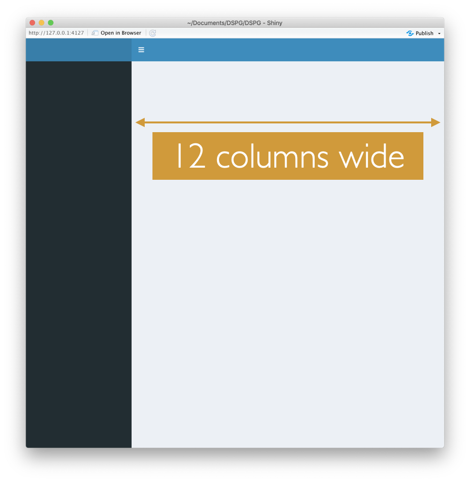
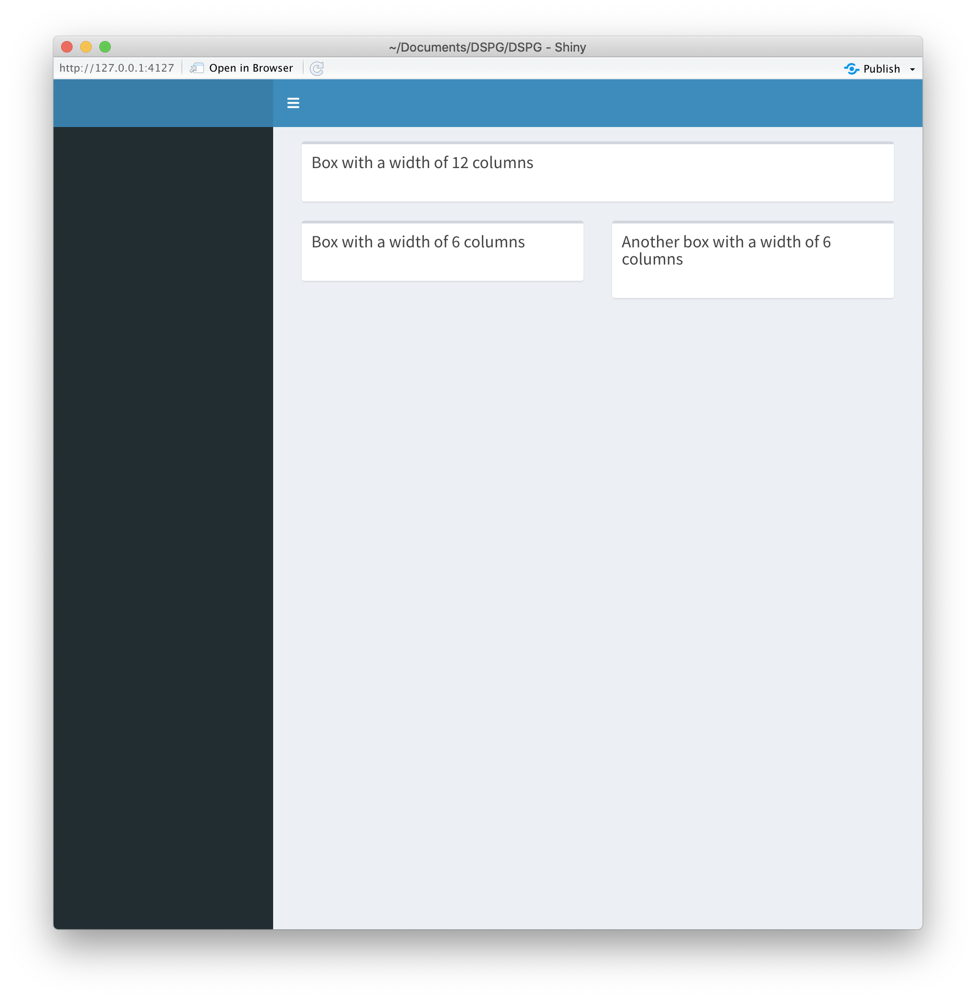
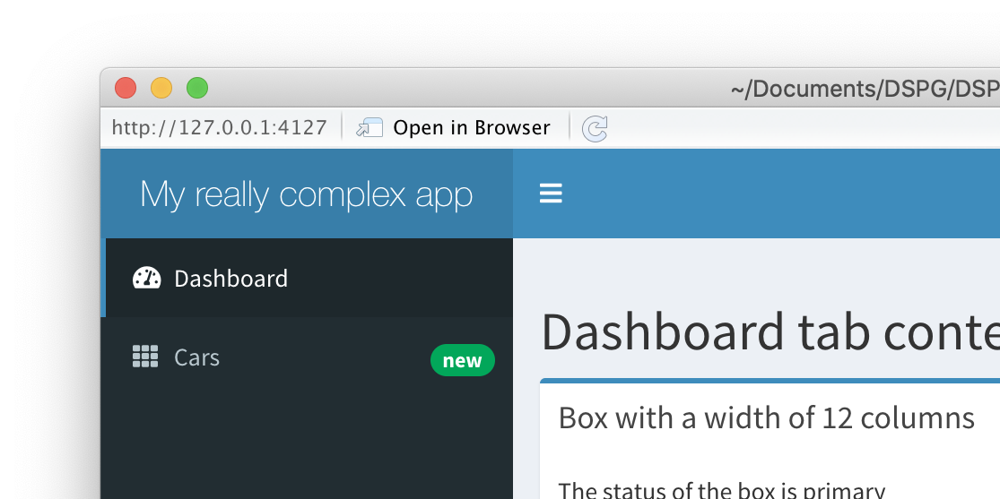
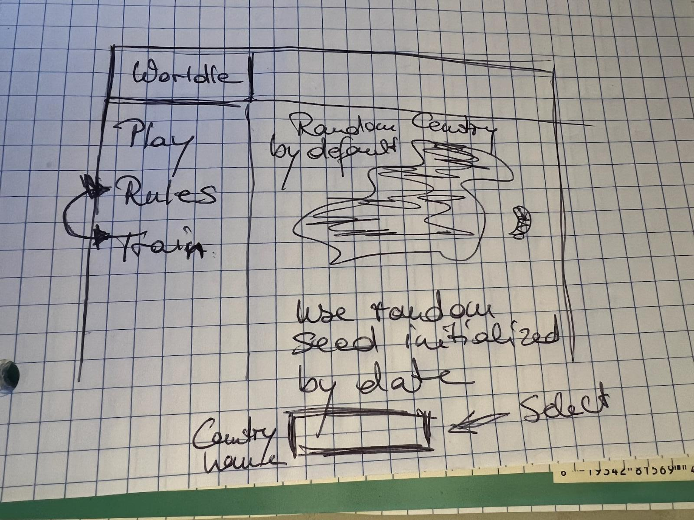

# Web apps with `shiny`

```{r setup, include=FALSE, message=FALSE, warning = FALSE}
knitr::opts_chunk$set(echo = TRUE)
library(rmarkdown)
```

- more layout choices for shiny apps: dashboards and navbars

- reactivity

- shiny apps in R packages

---

## Shiny app - Layouts

From the shiny Gallery in RStudio: 

  - https://shiny.rstudio.com/gallery/#user-showcase
  - https://shiny.rstudio.com/gallery/#demos

Additional packages for enhancing shiny packages:

- `shinyjs`: by [Dean Attali](https://deanattali.com/shinyjs/), adds additional javascript macros, e.g. enable/disable items, deal with form input

- `shinydashboard` by [RStudio](https://rstudio.github.io/shinydashboard/) for explicit dashboard layouts; used in [NZ Trade Dash](https://shiny.rstudio.com/gallery/nz-trade-dash.html)

- `shinyBS` by [Eric Bailey](https://ebailey78.github.io/shinyBS/install.html) for incorporating Bootstrap elements: used in [NY City Real Estate Investment](https://shiny.rstudio.com/gallery/real-estate-investment.html)

- `flexdashboard` by [Carson Sievert, RStudio]() incorporates shiny into Rmarkdown, e.g. [examples](https://pkgs.rstudio.com/flexdashboard/articles/examples.html), Youtube [video](https://www.youtube.com/watch?v=AVmfWL43B70)

---

# shinydashboard

Very basic app

```{r eval = FALSE}
library(shiny)
library(shinydashboard)

ui <- dashboardPage(
  dashboardHeader(),
  dashboardSidebar(),
  dashboardBody()
)

server <- function(input, output, session) {
  
}

shinyApp(ui, server)
```
---

# Boxes and layouts

Structure is introduced by 
boxes:

`box(..., title = NULL, width = 6, height = NULL)`



---

# Boxes in Layouts

```{r eval = FALSE}
body <- dashboardBody(
  fluidRow(
  box(title = "Box with a width of 12 columns", width = 12),
  box(title = "Box with a width of 6 columns", width = 6, height = 200),
  box(title = "Another box with a width of 6 columns", width = 6, height = 200)
  )
```



---

# Sidebar panels

```{r eval = FALSE}
sidebar <- dashboardSidebar(
  sidebarMenu(
    menuItem("Dashboard", tabName = "dashboard", 
             icon = icon("dashboard")),
    menuItem("Cars", icon = icon("th"), tabName = "cars",
             badgeLabel = "new", badgeColor = "green")
  )
)
```


---
class: inverse
# Your Turn

Download the dashboard source file from [bit.ly/dashboard585](https://raw.githubusercontent.com/Stat585-at-ISU/materials-2022/main/10_interactive/dashboard.R).

Open the file in RStudio and run the application. 
 There is a warning `This Font Awesome icon ('dashboard') does not exist`
(Doesn't happen now April 11 2023) ~~Fix it~~.

Now select the `Cars` tab and click on some of the cars in the table. 

How could you additionally change color of the selected items? and maybe show some labels?


---

# Reactivity in shiny


---

## Types of reactive elements


.pull-left[

- Sources

Any input widget is a source

- Conductors

Use input and are being used further along

- Observers

Any output is an observer

]

.pull-right[


]

---

# Two types of Conductors

- **Reactive expressions**: archetypical conductor -- envelope functionality used in multiple places of an app, run evaluations only once and store current values.

```{r eval = FALSE}
rval <- reactive({ 
  # R statements 
  })
```

Call as `rval()`.  Lazy evaluation. Run only when requested by endpoint. Results are cached. 

- **Reactive events**: only triggered by specific events (such as a click on an action button)

```{r eval=FALSE}
rval <- eventReactive(actionbutton,{
  # R statements
})
```

reactive events only executed on demand, typically an action button
---

# shiny apps in R packages

Source: [Dean Attali's discussion](https://deanattali.com/2015/04/21/r-package-shiny-app/)

1. Add `shiny` as a dependency in your DESCRIPTION file.

2. Put folder with shiny app in `inst/shiny-examples/` and 

3. Add an R file called `runExample.R`. 

The package’s tree structure should look like this

```{r eval=FALSE}
- mypackage
  |- inst
     |- shiny-examples
        |- myapp
           |- ui.R
           |- server.R
  |- R
     |- runExample.R
     |- ...
  |- DESCRIPTION
  |- ...
```

---

# runExample.R

Your `runExample.R` will be simple - it will just look for the Shiny app and launch it


```{r eval = FALSE}
#' @export
runExample <- function() {
  appDir <- system.file("shiny-examples", "myapp", 
                        package = "mypackage")
  if (appDir == "") { 
    stop(paste0("Could not find example directory. ",
         "Try re-installing `mypackage`."), call. = FALSE)
  }
  # the first app will be called
  shiny::runApp(appDir[1], display.mode = "normal") 
}
```

---
class: inverse
# Your Turn

Every app starts with a sketch ... start on a sketch for your app


 