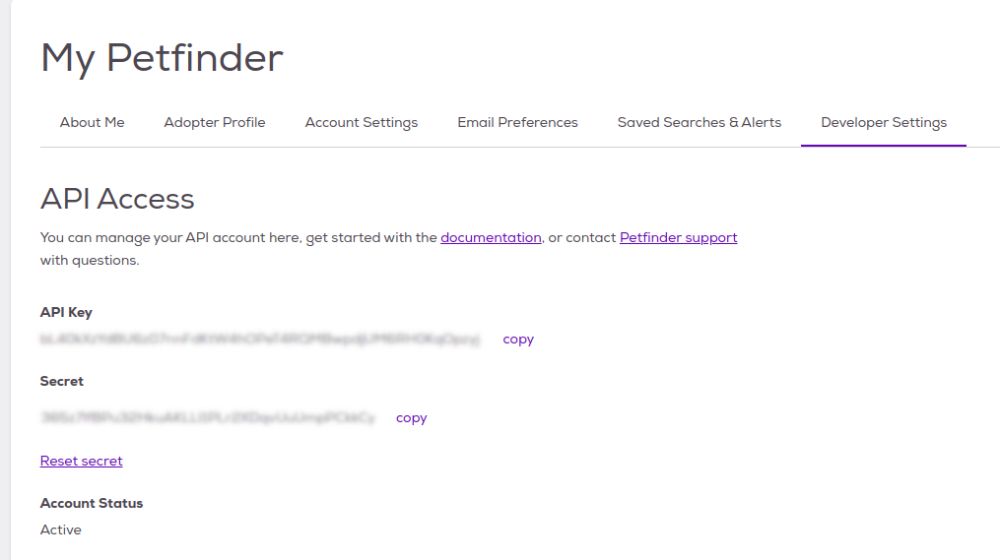
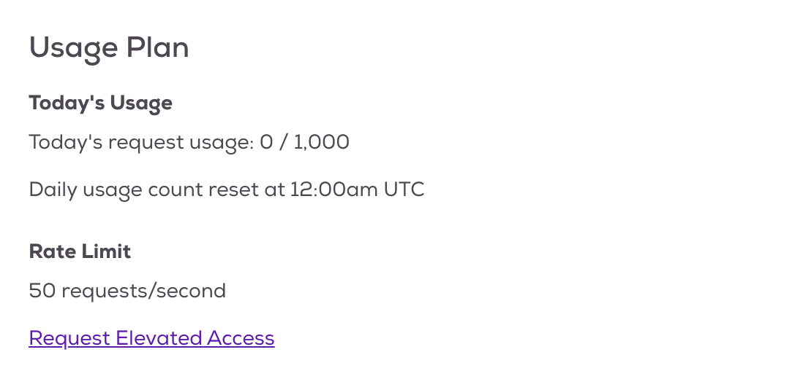
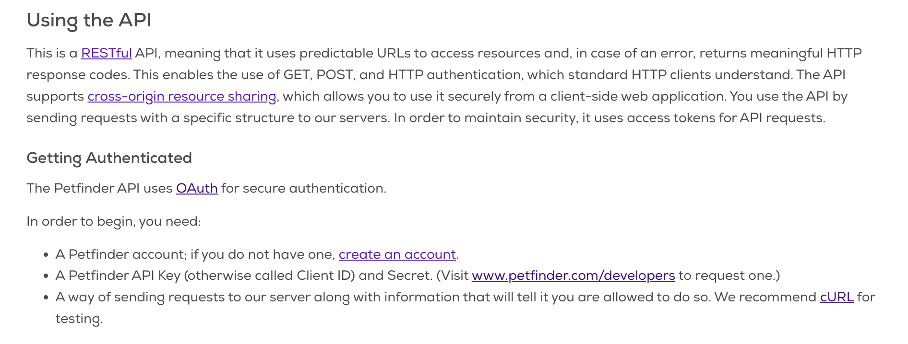
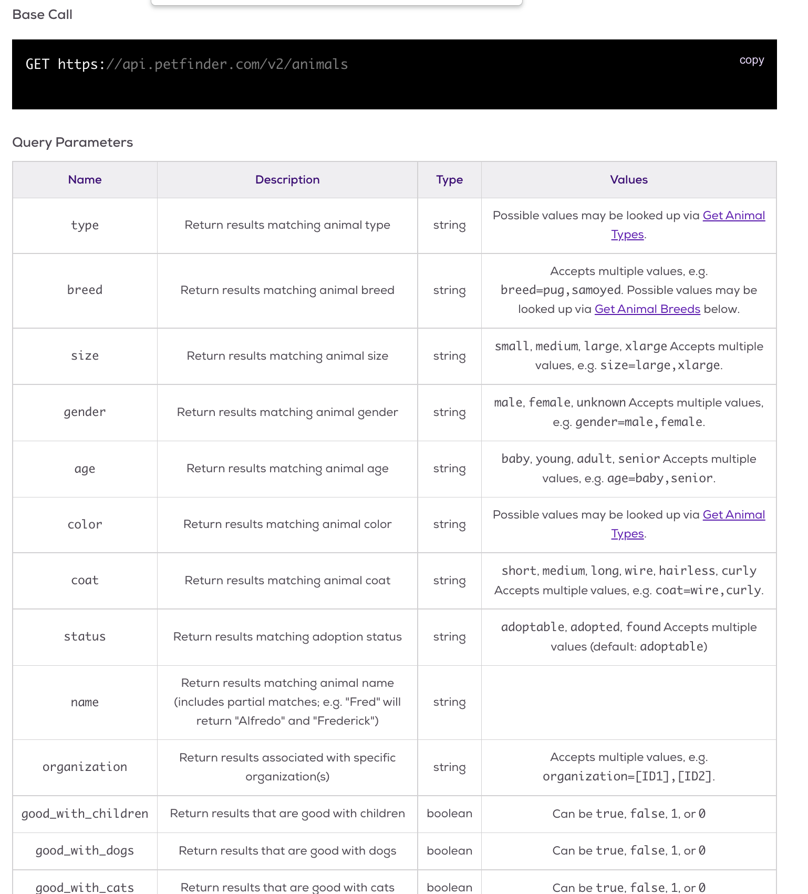

```{r setup, include=FALSE, message=FALSE, warning = FALSE}
knitr::opts_chunk$set(echo = TRUE, dpi= 300)
options(width=60)
library(tidyverse)
```


## Application Programming Interfaces (APIs)

- A set of instructions and standards for accessing structured information on the web

- A very convenient way to get data from the internet

- Usually, takes the form:    
`http://url.com?param1=value&param2=value2`

- Intended to make data available for other applications (e.g. developers of android apps, etc.)
    - More convenient than scraping HTML directly
    - Data is usually cleaner and better structured 

---

## Reading API Documentation

Most APIs come with some documentation:

- [Petfinder API](https://www.petfinder.com/developers/api-docs)

- [NOAA API](https://www.ncdc.noaa.gov/cdo-web/webservices/v2)

- [List of data.gov APIs](https://catalog.data.gov/dataset?q=-aapi+api+OR++res_format%3Aapi#topic=developers_navigation)

The documentation will tell you about 

- required authentication (and how to get an API key)
- rate limits (how many requests you can make at a time)
- query parameters and values


---

## API Authentication

Many APIs will allow you to register and obtain an API key



---

## API Rate Limits

APIs are a service provided for developers. Servers dedicated to these APIs are resource-limited, so be respectful of the data provider and the resource limits. 




---

## Getting Data



We will need to (1) Get our authorization token, then (2) build a request url: specify a category, then decide on an action, and any method search parameters

---

## Package `httr`

allows us to work with the http protocol and map queries:

```{r eval = FALSE}
httr::POST(
  url = NULL,
  config = list(),
  ...,
  body = NULL,
  encode = c("multipart", "form", "json", "raw"),
  handle = NULL
)
```

POST allows us to let the website know about our 

- **identity**: through the key and the secret
- **preferences**: which encoding do we want for the results? 

Result of a successful POST will contain our access token

---

## Getting the authorization token

From the Petfinder website on getting an access token: 

```{r eval = FALSE}
curl -d "grant_type=client_credentials&client_id={CLIENT-ID}&
client_secret={CLIENT-SECRET}" https://api.petfinder.com/v2/oauth2/token
```

```{r, echo = F, include = F}
library(rvest)
library(xml2)
```
```{r, eval = F}
library(rvest)
library(xml2)
key <- # Your key here
secret <- # Your secret here
endpoint <- 'oauth2/token'
url <- "https://api.petfinder.com/v2/"
req <- httr::POST(paste0(url, endpoint), 
                  body = list("grant_type"="client_credentials", 
                              "client_id" = key, 
                              "client_secret" = secret),
                  encode="json"
)
```
```{r, echo = F, include = F}
# save(req, file = "Request.Rdata")
load("Request.Rdata")
```
Save the token:
```{r}
token <- httr::content(req)$access_token 
```

---

## Categories and methods

```{r eval=FALSE}
curl -H "Authorization: Bearer {YOUR_ACCESS_TOKEN}" 
GET https://api.petfinder.com/v2/{CATEGORY}/
  {ACTION}?{parameter_1}={value_1}&{parameter_2}={value_2}
```


Read through [categories](https://www.petfinder.com/developers/v2/docs/#get-animals), most general category: `animals`




---
class: inverse
## Your Turn

Assume, we want to find all of the cats that are good with children  closest to Ames (zip code 50010)

Which search parameters do we need to specify? 

What does the url look like?

---

## Your Turn - Solution

cats are a *type*: type=cat

good_with_children=true

location=50010

The search string is therefore: 

```{r eval= FALSE}
animals?type=cat&good_with_children=true&location=50010
```

```{r echo=FALSE, eval=FALSE}
cats <- httr::GET(
  paste0(url, "animals?type=cat&good_with_children=true&location=50010"),
  httr::add_headers(Authorization = paste0('Bearer ', token, sep = ''))
  )
saveRDS(cats, "cats.rds")
```


```{r echo=FALSE, eval=TRUE, fig.keep='all'}
cats <- httr::content(readRDS("cats.rds"), as = "parsed")
paste(cats$animals[[1]]$name,
cats$animals[[2]]$name,
cats$animals[[3]]$name, sep=" ")

knitr::include_graphics(
  c(cats$animals[[1]]$photos[[1]]$medium, cats$animals[[2]]$photos[[1]]$medium, cats$animals[[3]]$photos[[1]]$medium))
```
---

## Method `GET` from package `httr`

```{r eval = FALSE}
httr::GET(url = NULL, config = list(), ..., handle = NULL)
```

`url` is the url of the page we want

`config` helps with additional setting - e.g `add_headers` for authorization

---
## Now get some actual data 

```{r, eval = F}
# Now get actual data
req_data <- httr::GET(
  paste0(url, "animals?type=dog&location=50010"),
  httr::add_headers(Authorization = paste0('Bearer ', token, sep = ''))
  )
```
```{r, echo = F, include = F}
# save(req_data, file = "DataRequest.Rdata")
load("DataRequest.Rdata")
```


```{r}
ames_dogs <- httr::content(req_data, as = "parsed")
str(ames_dogs)
```


---
class:inverse
## Your Turn

The [ames-dogs.Rdata](https://bit.ly/3tU4dKG) file is the result from the query on the last slide. 

```{r eval = FALSE}
url_dogs <- "https://bit.ly/3ZsuIUc" # download the file to your drive
download.file(url_dogs, destfile = "ames-dogs.Rdata", mode="wb")
load("ames-dogs.Rdata")
```

1. For the dogs returned by the API, assemble a data frame with their name, age, sex, breed(s), and shelter ID.

2. For each dog, can you assemble a list of picture links? (Hint: use list columns)

---

## Your Turn Solutions

```{r}
library(xml2)
getBreedInfo <- function(breed) {
  res <- "unknown"
  if (breed$unknown) return(res)
  res <- breed$primary
  if (!is.null(breed$secondary)) 
    res <- paste(res, breed$secondary, sep=", ")
  if (breed$mixed) res <- paste(res, "Mix", sep=", ")
  return(res)
}

dog_to_df <- function(x, verbose=FALSE) {
  if (verbose) {
    cat(x$name)
    cat("\n")
  }
  tibble(
    name = x$name,
    breed = getBreedInfo(x$breeds),
    age = x$age,
    sex = x$sex,
    id = x$id,
    shelterID = x$shelterId,
    pics = list(x$photos)
  )
}

ames_dog_df <- ames_dogs$animals %>% purrr::map_df(dog_to_df)
```

---

## Your Turn Solutions

```{r}
ames_dog_df
```

---

## Your Turn Solutions

```{r,  fig.show = 'all', out.width="10%"}
purrr::map_chr(ames_dog_df$pics, .f = function(x) {
    if (length(x) == 0) return(NA)
    x[[1]]$full
  }) %>% 
  na.omit() %>%
  knitr::include_graphics()
```

---

## Whether the weather or weather the weather?

Read through the [NOAA API](https://www.ncdc.noaa.gov/cdo-web/webservices/v2) documentation and try out queries in the web browser to check how to read responses correctly.

```{r}
jsonlite::read_json("https://api.weather.gov/points/41.9906,-93.6189")
```

---
class:inverse
## Your Turn

The NOAA Weather API has many layers. If you use the /points/ API and pass in latitude and longitude, 

`https://api.weather.gov/points/42.0238,-93.6161`

the returned JSON file provides links to other APIs. 

Use the `jsonlite` package to work with the returned JSON file (`jsonlite::fromJSON`).

Write a function that accepts latitude and longitude and returns the hourly forecast as a data frame. 

Can you plot the temperature forecast? 

---

## Your Turn - Solution

```{r}
get_weather <- function(lat, lon) {
  checkmate::assert_number(lat)
  checkmate::assert_number(lon)
  url <- sprintf("https://api.weather.gov/points/%f,%f", lat, lon)
  initialjson <- jsonlite::fromJSON(url)
  
  if (!checkmate::check_subset("properties", names(initialjson)) | 
      !checkmate::check_subset("forecastHourly", names(initialjson$properties))) {
    stop("No Information Found. Check Latitude/Longitude values.")
  }
  
  hourlyforecast <- jsonlite::fromJSON(initialjson$properties$forecastHourly)
  
  res <- hourlyforecast$properties$periods
  checkmate::check_data_frame(res)
  res
}
```
---

## Your Turn - Solution

```{r}
amesweather <- get_weather(42, -93.6) %>%
  mutate(startTime = lubridate::ymd_hms(startTime, tz = "America/Chicago")) 
```

```{r echo=FALSE, fig.height = 3.5}
# April 1: https://api.weather.gov/icons/land/night/skc,0?size=small  doesn't exist
amesweather$icon <- gsub(",0", ",1", amesweather$icon)
# Add icons for every 6 hour interval
maxtemp <- max(amesweather$temperature)
icons <- amesweather %>% filter(row_number() %% 6 == 1) 
icon_lst <- purrr::map2(
  icons$icon, icons$startTime, 
  ~cowplot::draw_image(.x, x = .y, y = maxtemp - 3, width = lubridate::hours(6), height = 6))

  ggplot() + 
  icon_lst + 
  geom_line(aes(x = startTime, y = temperature), data = amesweather) +
  xlab("Date") 
```

